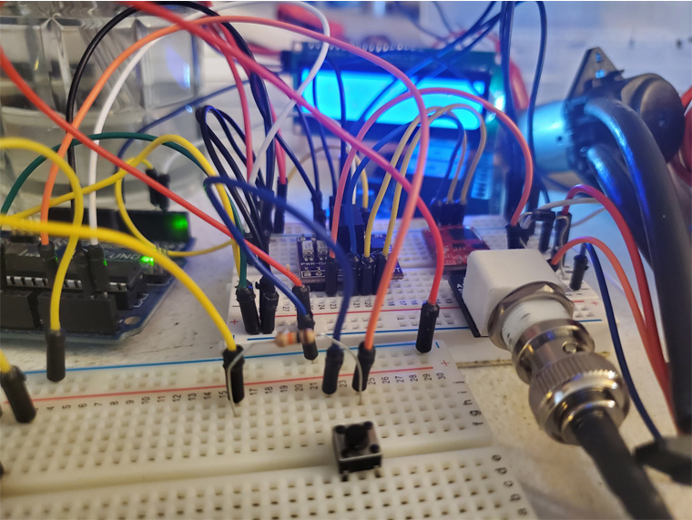

# ph-doser
automated ph doser system using arduino 

# Parts List

[Uno: 12$](https://www.amazon.com/SunFounder-Board-Arduino-ATMEGA328P-ATMEGA16U2/dp/B08353DL5P/ref=sr_1_7?dchild=1&keywords=arduino+uno&qid=1592458359&sr=8-7)

[paristaltic motor: 10$](https://www.amazon.com/INTLLAB-Peristaltic-Liquid-Aquarium-Analytical/dp/B0791YL351/ref=sr_1_23?dchild=1&keywords=peristaltic+motor&qid=1592458878&sr=8-23)

[*104 ceramic capacitor x3: 3$(its a 50 pack, you only need 3 of them)](https://www.amazon.com/Uxcell-a14111100ux0177-Through-Ceramic-Capacitor/dp/B00W8TM7FW/ref=sr_1_8?dchild=1&keywords=104+ceramic+capacitor&qid=1592459065&sr=8-8)

[Voltage Isolator 26$](https://www.amazon.com/dp/B07KJNQ918/ref=sspa_dk_detail_1?psc=1&spLa=ZW5jcnlwdGVkUXVhbGlmaWVyPUE1WjRFRUFGNU1CSFUmZW5jcnlwdGVkSWQ9QTA0ODcxOTgzUjM3OTZEOUdVVlEwJmVuY3J5cHRlZEFkSWQ9QTAxMDEwNDAxRDk3MkdEUkJMR0ZTJndpZGdldE5hbWU9c3BfZGV0YWlsMiZhY3Rpb249Y2xpY2tSZWRpcmVjdCZkb05vdExvZ0NsaWNrPXRydWU=)

[Bnc connector 7$](https://www.amazon.com/Atlas-Scientific-Pre-Assembled-Female-BNC/dp/B07NP5XXG3/ref=sr_1_3?dchild=1&keywords=bnc+atlas+scientific&qid=1592459324&sr=8-3)

[16x2 i2c lcd 3$](https://www.ebay.com/i/353078847458?chn=ps)

[push buttons x2 1$](https://www.amazon.com/microtivity-IM206-6x6x6mm-Tact-Switch/dp/B004RXKWI6/ref=pd_sbs_328_25?_encoding=UTF8&pd_rd_i=B004RXKWI6&pd_rd_r=6b2c0703-143f-4387-b2fd-5eb7c5fde668&pd_rd_w=7v47O&pd_rd_wg=FUPaH&pf_rd_p=d28ef93e-22cf-4527-b60a-90c984b5663d&pf_rd_r=RZH12CTW456V9S44MNBE&psc=1&refRID=RZH12CTW456V9S44MNBE)

[ph circuit 40$](https://www.amazon.com/Atlas-Scientific-Embedded-Circuit-001-14/dp/B00641R1PQ/ref=sr_1_6?dchild=1&keywords=atlas+scientific+ph&qid=1592459931&sr=8-6)

[12v power supply 8$](https://www.amazon.com/TMEZON-Power-Adapter-Supply-2-1mm/dp/B00Q2E5IXW/ref=sr_1_3?dchild=1&keywords=12v+ac+power+adapter&qid=1592460051&sr=8-3)

[ph probe 20$](https://www.amazon.com/Electrode-Socket-0-14pH-Controller-Economical/dp/B07KG2PQMN/ref=sr_1_6?dchild=1&keywords=ph%2Bprobe&qid=1592460152&sr=8-6&th=1)

Total: 130$

## License
[MIT](https://choosealicense.com/licenses/mit/)
